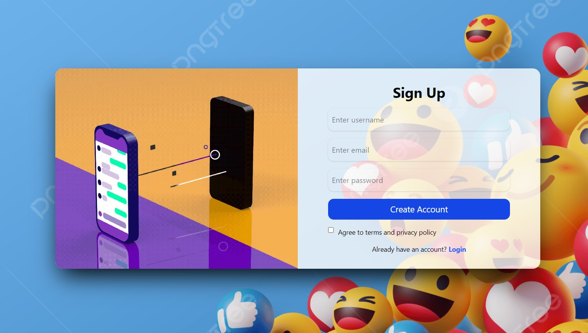
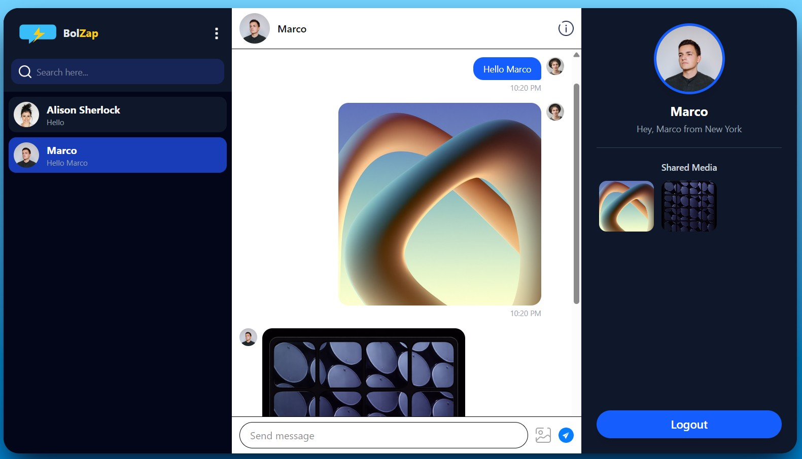
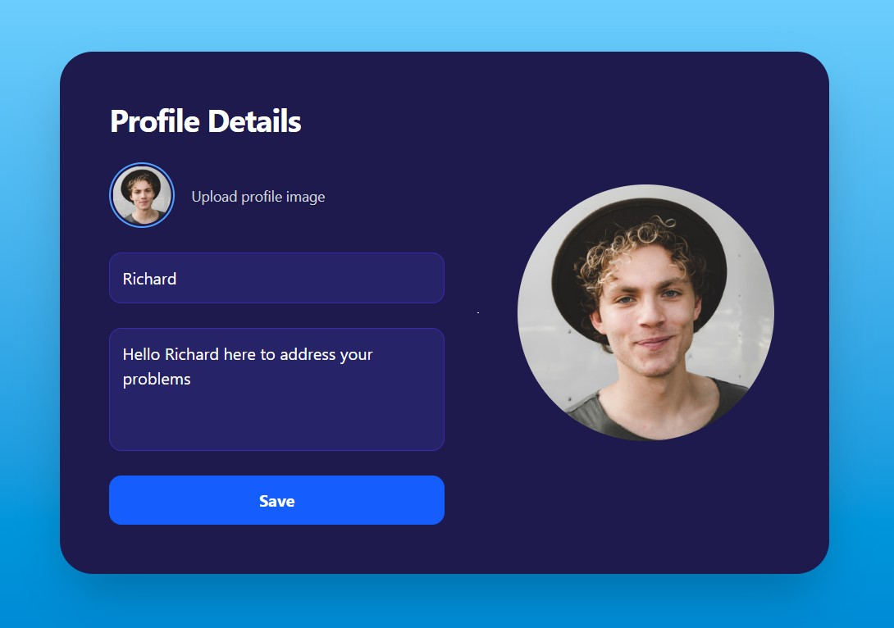

# BolZap – Real-Time Chatting Platform

## Overview

BolZap is a full-stack real-time chatting platform built to demonstrate modern frontend development and real-time application design.  
The project focuses on practical, real-world implementation rather than isolated feature demos, showcasing how production-style chat applications are structured and built.

---
## Live Project
https://bolzap.vercel.app/
---
## Preview


---
## Project Objectives

- Build a real-time messaging application using modern frontend tooling  
- Implement secure user authentication and session handling  
- Enable cloud-based image storage and delivery  
- Design a clean, responsive, and user-friendly chat interface  
- Demonstrate end-to-end data flow from UI to backend services  

---

## Key Features

- User authentication (Sign Up, Login, Logout)
- Real-time one-to-one messaging
- Image and media sharing in chats
- User profile creation and updates
- Contact list with active conversation highlighting
- Shared media panel per conversation
- Responsive and consistent UI design

---

## Tech Stack

### Frontend
- React  
- Vite  
- Tailwind CSS  
- JavaScript (ES6+)

### Backend / Services
- Firebase Authentication  
- Firebase Firestore (real-time database)  
- Cloudinary (media storage and delivery)

---

## System Architecture (High-Level)

1. Users authenticate using Firebase Authentication  
2. Messages are stored and synchronized in real time using Firestore  
3. Media files are uploaded to Cloudinary and referenced in chat messages  
4. React components manage rendering, state updates, and user interactions  

---

# Screenshots:

## Login Interface


## Chat Interface


## Profile Interface

---

## Setup and Installation

### Prerequisites

- Node.js (v18 or later recommended)
- npm or yarn
- Firebase account
- Cloudinary account

---

### Steps

1. Clone the repository  
   ```bash
   git clone https://github.com/your-username/BolZap-Chatting-Platform.git
   ```

2. Navigate to the project directory
    ```bash
    cd BolZap
    ```
3. Install dependencies

    ```bash
    npm install
    ```

4. Start the development server
    ```bash
    npm run dev
    ```
5. Open in browser

    ```text
    http://localhost:5173
    ```

## Skills Demonstrated
- Component-based frontend architecture

- Real-time database integration

- Authentication and session management

- Cloud-based media storage and delivery

- Secure environment variable handling

- UI/UX-focused application design

- Scalable and maintainable project structure

## Limitations
- One-to-one chat only (no group chats yet)

- No message reactions or read receipts

- No push notifications

- No video or voice calling

These limitations are intentional to keep the project focused and extensible.

## Future Enhancements
- Group chat support

- Message reactions and read indicators

- Typing indicators

- Video and voice calling

- Push notifications

- Message search and filtering

## Conclusion
BolZap demonstrates how modern frontend frameworks can be combined with managed backend services and cloud-based media storage to build scalable, real-time applications. 