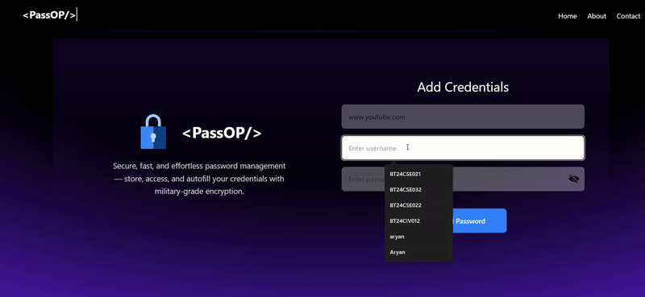

# 🔐 PassOP – Password Manager

PassOP is a lightweight, web-based **password manager** built to store, manage, and access credentials securely through a clean and practical interface. It focuses on usability first, without pretending to be a cybersecurity thesis.

---

## 🌐 Live Project

🔗 **PassOP Live Site:**  
https://passop-sigma-three.vercel.app/
---

## 📸 Preview
A demo video is included in the repository showing:
- Adding credentials
- Editing entries
- Copying passwords
- Opening websites directly

---
## 🚀 Features

### 🗂 Centralized Password Vault
- Store all your credentials in one place
- Each entry contains:
  - Website / Platform
  - Username
  - Password
- Displayed in a structured table for fast access

---

### 🔗 Direct Website Access
- Stored website URLs are **clickable**
- Opens the site in a new browser tab
- Saves time and reduces copy-paste chaos

---

### 📋 One-Click Copy
- Copy website URLs instantly
- Copy passwords securely without typing
- Reduces exposure and typing errors

---

### ✏️ Edit Credentials
- Update usernames or passwords anytime
- No need to delete and recreate entries
- Designed for frequent password changes

---

### 🗑 Delete Credentials
- Remove entries you no longer need
- Keeps the password vault clean and relevant

---

### 🎨 Clean & Responsive UI
- Minimal and distraction-free interface
- Fully responsive layout
- Works smoothly across desktop and smaller screens

---

### 🔐 Security-Oriented Design
- Passwords are not openly exposed by default
- Clipboard-based access instead of manual viewing
- External links use safe browser practices (`noopener`, `noreferrer`)

---

## 🛠 Tech Stack
- **Frontend:** React
- **Styling:** Tailwind CSS
- **State Management:** React component state
- **Utilities:** Clipboard API for copy functionality

---

# Screenshots

- Adding credentials

- Editing entries
- Copying passwords
- Opening websites directly
  

---

## 📌 Why PassOP?
- Simple enough for everyday users
- Fast enough for daily usage
- Secure enough to avoid reckless practices

No bloated features. No fake security claims. Just a functional password manager.

---

## 📄 License
This project is licensed under the **MIT License**.

---

## 👤 Author
Built by **Aryan Sharma**

